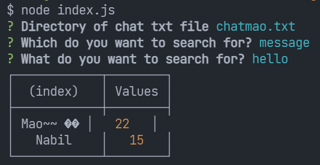

# Node-Whatsapp-Chat-Counter
> Find the number of times someone said something

# How to use?
1.  Export your chat. Find out more [here](https://faq.whatsapp.com/android/chats/how-to-save-your-chat-history/?lang=en).
2.  Run `npm install` at the root directory to install the required packages.
3.  Run `node index.js`.

# Objects
### Message
-   date
    -   Date of message
-   author
    -   Author of message
-   message
    -   The content of the message

# MessageParser Documentation
### constructor(pathname, groupchat)
-   pathname (string)
    -   The path of the chat txt file
-   groupchat (boolean) - deprecated
    -   The chat txt file came from a group chat
### async parse(): void
-   Parse the data given
### getAuthors(): Array\<string>
-   Gets all the authors for the chat
### writeToFile(): promise
-   Writes the parsed data to a file
### getMessagesMatch(key, query): Array\<Message>
-   key (string)
    -   Only accepted values are "author" and "message". The query will look based on the key given.
-   query (string)
    -   The query for the key given above